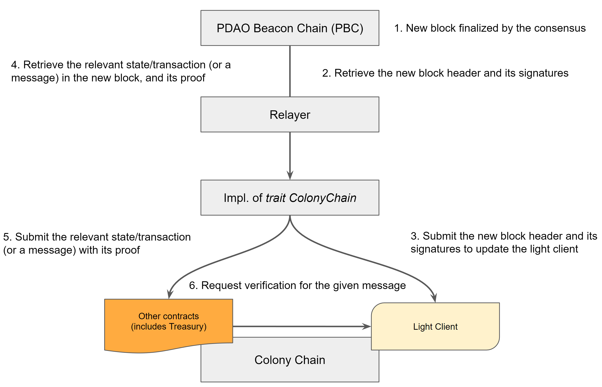

# Instruction for Colony Chain Developers

이 문서는 콜로니 체인을 개발하기 위한 가이드를 제시합니다.

기본적인 내용은 일단 본 저장소에 같이 들어있는 Rust Crate들인
`pdao-colony-common`과 `pdao-colony-contract-common`을 **필수적으로** 참고해주세요.

콜로니 체인이 정상적으로 PBC 프레임워크 아래에서 작동하기 위해서는 아래의 작업들이 필요합니다.
각각의 태스크에 대해 자세한 스펙은 crate에 들어있는 Doc comment를 참고해주세요.

1. Light Client 컨트랙트 개발 및 디플로이
2. Treasury 컨트랙트 개발 및 디플로이
3. `trait ColonyChain` 구현

Light Client와 Treasury가 뭘 할 수 있어야 하는 지는 `trait ColonyChain`를 보면 정확하게 알 수 있습니다. (그러니 꼭 인터페이스와 그 주석을 꼼꼼히 읽어보세요)
다만 그 구현의 디테일에 대해 불명확 부분이 있을 수도 있기에 본 문서에서 자세히 설명합니다.

## 구조도

## Light Client 컨트랙트

Light Client는 해당 콜로니 체인에 업로드된 다른 컨트랙트들(Treasury 포함)이 공통적으로 사용하는 컨트랙트입니다.
컨트랙들에서 특정한 액션을 수행하기 위해 메세지를 전달할 때, 그 메세지가 PBC에서 컨센서스가 이뤄진 게 맞는지 검증을 해줍니다.

### 트랜잭션

- `ColonyChain::update_light_client()`를 수행하는 트랜잭션를 정의해야 합니다.

### 쿼리

- `ColonyChain::get_light_client_header()`를 수행하는 쿼리 메소드를 정의해야 합니다.

### 크로스 컨트랙트 인터랙션

Treasury 컨트랙트를 비롯한 다른 컨트랙트에 대한 트랜잭션을 수행하는 도중에 Light Client의 함수를 호출 할 수 있습니다. (크로스 컨트랙트)
따라서 이를 위한 인터페이스를 정의하고 다른 컨트랙트들에게 제공하는 것이 중요합니다.
또한 컨트랙트간 인터랙션 방법은 체인마다 상이할 것으로 예상되니 조사가 필요합니다. (이 것과 관련한 유명한 해킹기법이 reentrancy attack 입니다)
인터페이스의 디테일은 `pdao_colony_contract_common::light_client::LightClient::verify_commitment()`를 참조해주세요.

### 구현

검증로직과 내부상태는 `Simperby`가 정의합니다. `pdao-colony-contract-common`에 있는 `struct LightClient`를 사용하면 되고 그 이상으로 직접 알아야할 내용은 없습니다.
Light Client 컨트랙트 구현체에서는 `lightClient`를 ***import***해서 사용하기만 하면 됩니다. 즉 코드를 복붙하거나 참고만 하고 새로만드는게 아니라 그대로 디펜던시에 넣고 갖다 쓰는 게 올바른 사용방법입니다.

## Treasury 컨트랙트

Treasury 컨트랙트는 임의의 종류의 FT와 NFT를 갖고 있다가 (기부자들이 직접 이 컨트랙트에 송금합니다)
PBC의 명령에 따라 적절히 다른 주소로 출금해주는 컨트랙트입니다.

### 트랜잭션

- `ColonyChain::transfer_treasury_fungible_token()`를 수행하는 트랜잭션을 정의해야 합니다.
- `ColonyChain::transfer_treasury_non_fungible_token()`를 수행하는 트랜잭션을 정의해야 합니다.

### 쿼리

- `ColonyChain::get_treasury_fungible_token_balance()`를 수행하는 쿼리 메소드를 정의해야 합니다.
- `ColonyChain::get_treasury_non_fungible_token_balance()`를 수행하는 쿼리 메소드를 정의해야 합니다.

### 크로스 컨트랙트 인터랙션
Light Client와 다르게 Treasury는 크로스 컨트랙트 인터랙션의 Callee가 아닌 Caller입니다.
Light Client로 들어오는 두 트랜잭션을 수행할 때에는 무조건 Light Client가 제공해주는 `verify_commitment()`를 사용해야합니다.

### 토큰 모델

체인마다 토큰에 대한 모델과 스펙 (EVM의 ERC20 등)은 상이할 것입니다.

- Native, 혹은 first-class 토큰 (Etheruem의 Ether 등)이 특별취급 될 경우 이를 고려해야합니다.
- NFT의 경우 collection 내에서 토큰 index를 지정하는 방식을 조사해야 합니다. (ERC721에서는 256비트 정수를 그냥 사용합니다)

### 보안

토큰이 오고가는 컨트랙트인 만큼 기본적인 보안사항을 지켜아합니다. (추후 엄격한 3자 검증을 할 예정이긴 합니다)

- Reentrancy attack와 같은 유명한 취약점들은 조사해보고 해당하는지 알아봅시다
- 각 체인의 VM에 specific한 내용들은 추가로 조사해봅시다. (세미나도 좋습니다)

## ColonyChain 구현

`trait ColonyChain`을 구현함으로써 디플로이된 상기 두 컨트랙트와 상호작용을 (두 컨트랙트 **간**의 상호작용과 다릅니다) 할 수 있습니다.
자세한 스펙은 crate를 참고해주세요.

- 구현체는 본 저장소가 아닌 각 체인의 저장소에 올라가야 합니다.
- 테스트를 위해 `Custom` 컨트랙트를 하나 개발 해보는 것도 권장합니다.
- 하는 일이 본질적으로 디플로이 된 컨트랙트와 상호작용 하는 것이므로 당연히 `interact`를 사용할 것입니다. 이와 관련해서는 [링크](./interact.md)를 참고 해주세요.

### 초기화 및 상태

`trait ColonyChain`에 명시되지 않은 내용, 예컨대 상태나 초기화 함수등은 자유롭게 정의하시면 되지만 기본적으로

1. 계정정보
2. 풀노드 URI
3. 디플로이된 컨트랙트 주소
정도의 정보로 충분할 것입니다.
